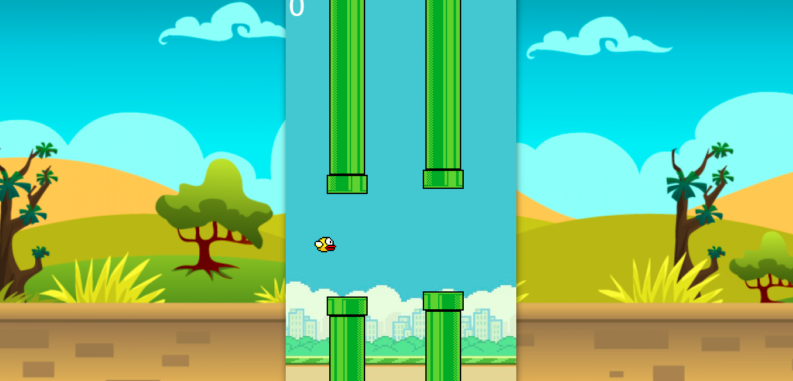
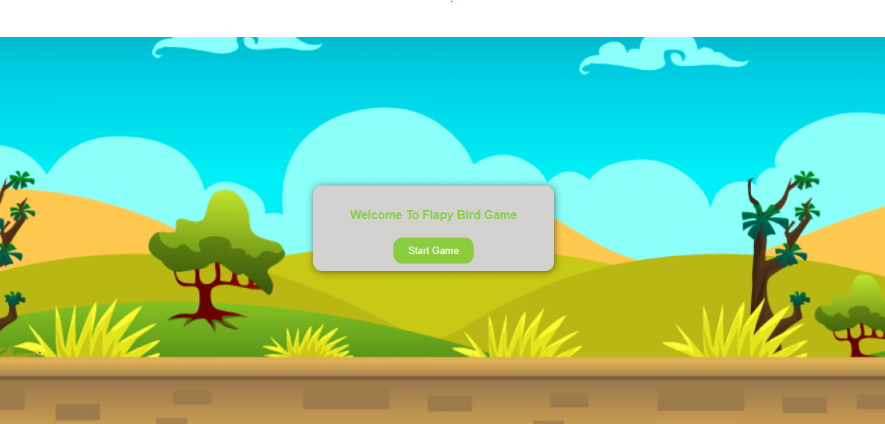
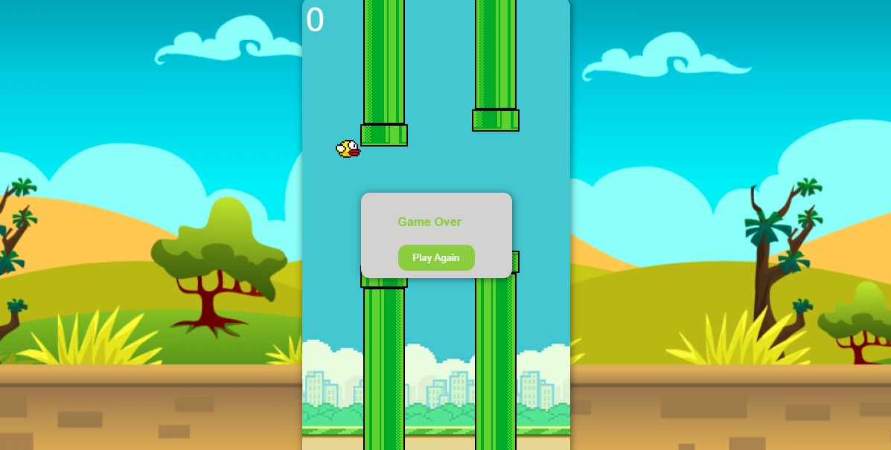

# 🐦 Flappy Bird Game

## Introduction

Welcome to my beautifully crafted, fully responsive Flappy Bird game! This project is built using HTML, CSS, Bootstrap, and JavaScript, providing an engaging and seamless experience across all devices.

## Features

- **Responsive Design:** Enjoy a flawless experience on desktops, tablets, and smartphones.
- **Stunning Visuals:** Vibrant graphics and smooth animations for an immersive gameplay experience.
- **Intuitive Controls:** Easy to play, challenging to master!
- **Optimized Performance:** Ensuring fast load times and minimal lag.

## Demo

Check out the live demo: [Flappy Bird Game]( https://farhansahibzada.github.io/Flappy-Bird-Game/)

## How to Play

1. Press the spacebar or UpArrow Key to make the bird flap.
2. Avoid the pipes and keep the bird in the air as long as possible.

## Screenshots

## Technologies Used

- **HTML5:** For structuring the game content.
- **CSS3 & Bootstrap:** For styling and responsive design.
- **JavaScript:** For game logic and interactivity.

## License

This project is licensed under the MIT License. See the [LICENSE](LICENSE) file for details.

## Acknowledgements

- Inspired by the original Flappy Bird game by Dong Nguyen.
- Thanks to all the contributors and open-source projects that made this project possible.

---

⭐️ If you like this project, please give it a star on GitHub!
